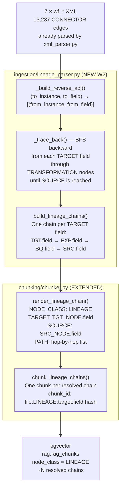
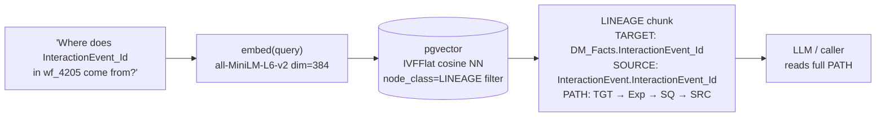

# S02 — 2026-08-12 — RAG System: Field-Level Lineage Parsing

## Architecture

### Lineage Data Flow

### Retrieval — Lineage Query

---

## Goal
Add field-level lineage tracking to the RAG system so queries like
*"where does TARGET.field come from?"* return complete hop-by-hop paths
from TARGET through TRANSFORMATION nodes back to SOURCE tables.

## Why this matters for PySpark migration
Without lineage, the migration engineer has to manually trace ports across
the Informatica mapping canvas to understand what feeds each target column.
With lineage chunks in the RAG, the LLM can cite the exact lineage path in its
generated PySpark code — directly mapping `col("INTERACTION_ID")` to its
source column and transformation logic.

## Delivered

### `rag-system/src/rag_system/ingestion/lineage_parser.py` (new)
- `_build_reverse_adj(connectors)` — inverts 13,237 CONNECTOR edges into a reverse lookup: `(to_instance, to_field) → [(from_instance, from_field)]`
- `_trace_back(start_instance, start_field, ...)` — BFS backward from any node/field until a SOURCE is reached; returns all complete paths
- `build_lineage_chains(parsed, source_file)` — entry point; iterates all TARGET fields, calls `_trace_back`, returns list of chain dicts
- `summarise(chains)` — returns stats: total, resolved, unresolved, max_depth, unique sources/targets

### `rag-system/src/rag_system/chunking/chunker.py` (extended)
- `render_lineage_chain(chain)` — converts a chain dict to self-describing text with labels `NODE_CLASS: LINEAGE`, `TARGET:`, `SOURCE:`, `PATH:` — one hop per line
- `chunk_lineage_chains(chains, source_file)` — wraps each resolved chain in a `Chunk` with `node_class="LINEAGE"` and metadata: mapping, target_instance, target_field, source_instance, source_field, hop_count

### `rag-system/src/rag_system/knowledge_base.py` (extended)
- `build_from_folder()` now calls `parse_powercenter_xml()` + `build_lineage_chains()` + `chunk_lineage_chains()` for each XML file after chunking the regular nodes
- Lineage chunk count logged separately

### `rag-system/tests/test_smoke.py` (extended — 6 new tests)
- `test_lineage_chains_resolved` — at least one chain resolves to a SOURCE
- `test_lineage_chain_fields` — chain has correct target/source instance and field names
- `test_lineage_chain_hops_order` — path is ordered TARGET → … → SOURCE
- `test_lineage_chunk_rendered` — rendered text contains required labels
- `test_lineage_chunk_id_stable` — same chain produces the same chunk_id deterministically
- `test_lineage_chunk_node_class` — all lineage chunks have `node_class == "LINEAGE"`

## Corpus Stats — Lineage

| File | CONNECTOR edges |
|---|---|
| wf_0000_eintr_lmt_load_confirmation.XML | 4 |
| wf_4201_calculate_interaction_facts.XML | 3,126 |
| wf_4202_fnd_rltinteraction.XML | 253 |
| wf_4203_calculate_interaction_facts_fbl.XML | 1,114 |
| wf_4204_fnd_rltinteraction_fbl.XML | 111 |
| wf_4205_calculate_dm_facts.XML | 7,194 |
| wf_4206_calculate_facts_fcr.XML | 1,435 |
| **Total** | **13,237** |

Lineage chunk count after ingest: TBD (requires XML files accessible — run `POST /ingest` when OneDrive synced)

## Test Results
**20/20 smoke tests pass** (14 original + 6 new lineage tests)

## Known Limitations
- **Unresolved chains are excluded**: if a CONNECTOR chain has no path to a SOURCE (e.g. intermediate aggregators with no upstream), the chain is skipped from indexing. Logged as a warning.
- **INSTANCE vs TRANSFORMATION name**: Informatica can assign different instance names to transformations reused in a mapping — the current resolver uses instance names (which match CONNECTOR FROMINSTANCE/TOINSTANCE) rather than transformation names. Should be correct for this corpus.
- **No cross-mapping lineage**: a field that flows from one mapping's target into another mapping's source is not currently traced across mapping boundaries.
- **Lineage chunk count not yet validated** against pgvector (requires OneDrive XML sync + re-ingest)

## Next (S03)
- Retrieve lineage via `GET /retrieve?q=...&node_class=LINEAGE` 
- Add golden dataset entries for lineage queries (ground truth for retrieval eval harness)
- Cross-mapping lineage: trace through staging tables between mappings
- Hybrid BM25 + vector retrieval so exact field name matches rank higher
