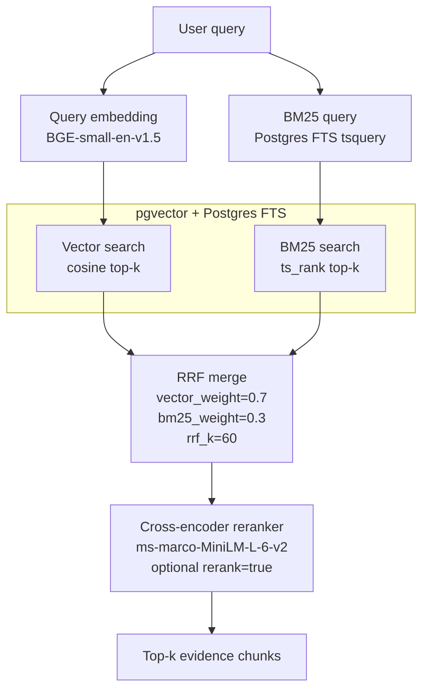
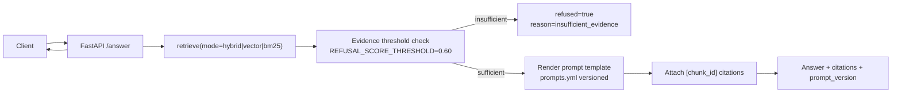

# S03 — 2026-08-13 — RAG System: Hybrid Retrieval + Reranking + Citation Answers

## Architecture

### Hybrid Retrieval Pipeline

### Answer Runtime Flow

---

## Goal
Improve retrieval quality and answer trustworthiness by combining lexical and vector retrieval, optional reranking, and citation-backed responses with refusal on weak evidence.

## Delivered
- `store/vector_store.py`: added BM25 full-text search, hybrid retrieval, and Reciprocal Rank Fusion.
- `knowledge_base.py`: added `hybrid_search()` path with fallback behavior.
- `api/app.py`: extended `/retrieve` with `mode=hybrid|vector|bm25` and optional `rerank=true`.
- `reranking/cross_encoder.py`: added cross-encoder reranking for higher precision top-k.
- `api/app.py`: added `/answer` endpoint that returns evidence-backed answers with chunk citations.
- Refusal policy: added insufficient-evidence guardrail using top-hit similarity threshold.
- `prompts/prompts.yml`: introduced versioned prompt templates.
- `src/rag_system/prompts/__init__.py`: added prompt loading, listing, and rendering utilities.
- `api/app.py`: added `/prompts` and extended `/health` with prompt-version visibility.
- Fixed FastAPI deprecation warning by replacing `regex=` with `pattern=`.

## Embedding / Model Choices
- Retrieval embedding: BGE-small-en-v1.5 for dense vector similarity.
- Reranker: `cross-encoder/ms-marco-MiniLM-L-6-v2` for query-passage relevance scoring.
- Hybrid strategy: vector + BM25 fused by RRF to balance semantic recall with exact-term precision.

## Corpus / Data Stats
- Indexed rows in `rag.rag_chunks`: 703.
- Test status: 20/20 smoke tests passing.
- Refusal calibration: unrelated queries around ~0.53, in-domain queries around ~0.79+.

## Known Limitations
- Reranker adds latency and may be expensive for larger candidate pools.
- Refusal threshold is heuristic and may need per-domain tuning.
- BM25 tokenization behavior depends on Postgres text search configuration.
- Lineage chunk count still requires explicit re-ingest validation when OneDrive XMLs are fully available.

## Next (S04)
- Add retrieval quality benchmarks for hybrid vs vector vs bm25 by query class.
- Introduce cached rerank results for repeated queries.
- Tune refusal threshold using a labeled eval set.
- Add automated regression tests for citation completeness and refusal behavior.
