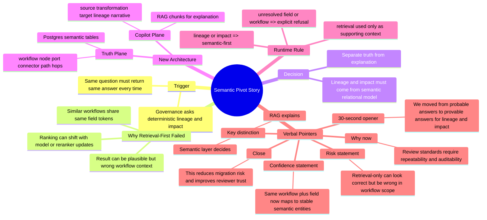

# Semantic Pivot Mindmap + Verbal Pointers

Use this as a quick prep sheet for architecture reviews and stakeholder walkthroughs.

## 1) Verbal Pointers (What To Say)

### 30-second opener
"We pivoted from retrieval-first RAG to semantic-first for lineage and impact because reviewers need deterministic, auditable answers. RAG is still used, but as a copilot for explanation, not as the source of truth."

### Why the old approach was risky
- "Top-k ranking can shift with model and reranker updates."
- "Identifier-heavy fields appear across similar workflows, so answers can look right but point to the wrong workflow context."
- "Lineage chunks improved recall, but final selection was still probabilistic."

### Key distinction to repeat
- "Semantic layer decides."
- "RAG explains."

### If asked: what changed technically?
- "Lineage and impact now resolve from normalized Postgres semantic entities (workflow, node, port, connector, path, hops)."
- "Ingestion now builds workflow graphs first, derives lineage deterministically, and persists a workflow graph hash for traceability."
- "Node/path explanation artifacts are generated from deterministic facts and retrieved second as evidence-linked narrative context."
- "If workflow or field is unresolved, the system fails closed with explicit refusal."
- "Retrieval is secondary context for narrative explanation and citations."

### If asked: what is still chunked?
- "SOURCE, TRANSFORMATION, TARGET chunks are still indexed for copilot behavior."
- "LINEAGE narrative chunks are still available for explanation."
- "But deterministic lineage and impact decisions do not come from chunk ranking anymore."

### 20-second close
"This change reduces migration risk, improves reproducibility, and gives reviewers a clear audit trail from answer back to stable semantic records."

### If asked: what is next in the same project?
- "We integrated P3 observability into this project with a two-week extension."
- "Week +1 adds trace/timing/cost telemetry; Week +2 adds alerts, gates, and incident runbook readiness."

## 2) Mindmap

## 3) Rapid Q&A Prompts

1. Why not pure RAG?
- "Because governance questions require deterministic outputs, and RAG ranking is probabilistic by design."

2. Why keep RAG then?
- "It is excellent for explanation, discovery, and analyst-friendly narratives on top of deterministic truth."

3. What does semantic-first buy us?
- "Repeatability, strict scope control, fail-closed behavior, and audit-grade traceability."
