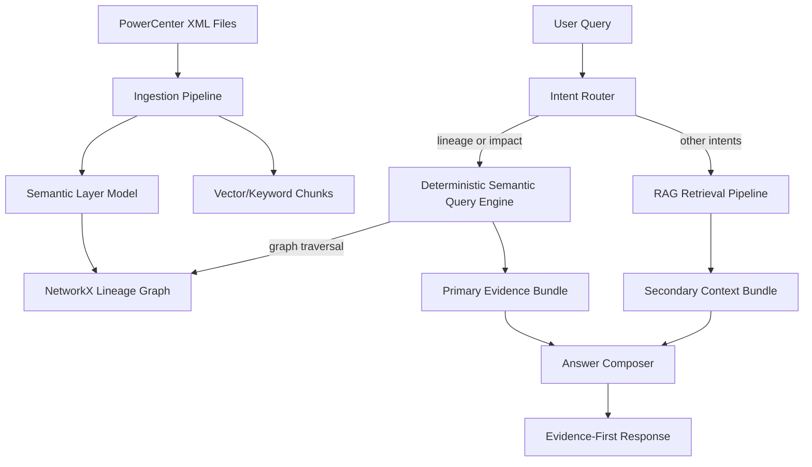

# Informatica Semantic-First E2E Design

> For the merged deep-read walkthrough that combines this E2E design with conceptual architecture and code-cited examples, see [PROJECT_BIBLE.md](./PROJECT_BIBLE.md).

## 1. Objective

This system is now designed as a semantic-first architecture for Informatica workflows.

Design rule:

1. Deterministic semantic layer is the system of truth.
2. RAG is a copilot for explanation, summarization, and natural-language UX.
3. Lineage/impact answers are never synthesized from vector context when semantic evidence is missing.

This replaces the prior retrieval-first behavior for lineage-critical questions.

## 2. Why This Change

Observed issue in prior design:

1. Pure retrieval could mix relevant but non-authoritative transformation context.
2. For lineage questions, plausible text could appear without strict field-level proof.

Required outcome:

1. Workflow + field constrained deterministic answers for lineage and impact.
2. Explicit `not indexed` or `unresolved` responses when structured evidence is missing.

## 3. Target Architecture



## 3.1 Graph-Augmented Semantic Runtime

For lineage/impact intents, runtime now uses a graph-augmented deterministic flow:

1. Resolve intent via LLM-enabled router with deterministic SQL override short-circuit.
2. Resolve workflow hint + field anchor from query.
3. Query NetworkX lineage engine first (workflow-scoped or cross-workflow field identity mode).
4. If graph state is unavailable, fallback to PostgreSQL semantic query path.
5. Return deterministic evidence paths; retrieval context is secondary and non-authoritative.

Cross-workflow behavior:

1. When workflow hint is absent and field anchor exists, graph uses canonical field identity nodes (`field::<field_norm>`) to discover occurrences across workflows.
2. Response remains deterministic and evidence-backed; no vector-only synthesis for truth claims.

## 4. Semantic Layer as Truth

The semantic layer is built during ingestion and persisted in PostgreSQL as normalized relational tables (`rag.semantic_*`).

In-memory semantic objects are still maintained as a fallback/runtime cache, but PostgreSQL is the durable source of truth for deterministic lineage and impact queries.

### 4.1 Entity Model

1. `Workflow`
2. `Mapping`
3. `Node` (`SOURCE`, `TRANSFORMATION`, `TARGET`)
4. `Port` (fields/ports with role/datatype/expression)
5. `Connector` (edge: from node.port -> to node.port)
6. `LineagePath` (resolved target-to-source path with hops)

### 4.3 PostgreSQL Physical Model

Primary semantic tables:

1. `rag.semantic_workflows`
2. `rag.semantic_mappings`
3. `rag.semantic_nodes`
4. `rag.semantic_ports`
5. `rag.semantic_connectors`
6. `rag.semantic_lineage_paths`
7. `rag.semantic_lineage_hops`

`rag.semantic_workflows` includes workflow-level graph metadata (`graph_hash`) so each semantic snapshot is version-traceable to the connector/target topology used during graph-first derivation.

Fast deterministic lookup indexes:

1. `semantic_workflows(lower(source_file))`
2. `semantic_lineage_paths(workflow_key, lower(target_field))`
3. `semantic_lineage_paths(workflow_key, lower(source_field))`
4. `semantic_lineage_hops(workflow_key, field_norm)`
5. connector from/to lookup indexes by node+port

### 4.2 Example Semantic Records

Example `Connector` edge:

```json
{
  "edge_id": "52d9c83b5a1f",
  "workflow": "wf_4202_fnd_rltinteraction.XML",
  "mapping": "m_4202_dt_chn_rltinteractionagreement",
  "from_node": "SQ_DT_FND_EINTR",
  "from_port": "INTERACTION_ID",
  "to_node": "EXP_SHARED_ATTRIBUTES",
  "to_port": "INTERACTION_ID"
}
```

Example `LineagePath`:

```json
{
  "evidence_id": "semantic:lineage:ab93f2d8a7610c7f",
  "workflow": "wf_4202_fnd_rltinteraction.XML",
  "mapping": "m_4202_dt_chn_rltinteractionagreement",
  "target_instance": "DT_CHN_RLTINTERACTIONAGREEMENT",
  "target_field": "INTERACTION_ID",
  "source_instance": "DT_FND_EINTR",
  "source_field": "INTERACTION_ID",
  "hop_count": 2,
  "resolved": true,
  "hops": [
    {"instance": "DT_CHN_RLTINTERACTIONAGREEMENT", "field": "INTERACTION_ID", "node_class": "TARGET"},
    {"instance": "SQ_DT_FND_EINTR", "field": "INTERACTION_ID", "node_class": "TRANSFORMATION"},
    {"instance": "DT_FND_EINTR", "field": "INTERACTION_ID", "node_class": "SOURCE"}
  ]
}
```

## 5. Deterministic Query Engine

Two deterministic query methods are implemented in `InformaticaKnowledgeBase`:

1. `query_semantic_lineage(workflow_hint, field_name, limit)`
2. `query_semantic_impact(workflow_hint, field_name, limit)`

### 5.1 Hard Filters

Both methods require:

1. Workflow scope (`wf_....XML`)
2. Exact field/entity anchor (`InteractionEvent_Id`, `INTERACTION_ID`, etc.)

No semantic query runs without both anchors in semantic-first routing.

### 5.2 Deterministic Status Codes

Returned statuses:

1. `ok`
2. `workflow_not_indexed`
3. `field_not_found`

These statuses are used directly by answer guardrails.

## 6. RAG as Copilot

RAG remains active for:

1. intent understanding
2. conversational explanation
3. summarization
4. non-authoritative contextual enrichment

For lineage/impact answers:

1. semantic evidence is primary
2. vector evidence is optional secondary context only
3. secondary context cannot override primary evidence

## 7. Guardrail Routing

Semantic-first routing logic:

1. If intent is `lineage` or `impact`, route to semantic query engine first.
2. If workflow hint is missing: refuse with `semantic_workflow_required`.
3. If field anchor is missing: refuse with `semantic_field_required`.
4. If workflow not indexed: refuse with `semantic_workflow_not_indexed`.
5. If field unresolved in semantic model: refuse with `semantic_field_unresolved`.

No fallback to retrieval synthesis for these guardrail failures.

## 8. Evidence-First Answering Contract

### 8.1 Evidence Order

Response evidence list is ordered:

1. primary semantic evidence entries (`evidence_source = semantic_layer`)
2. secondary vector context entries (`evidence_source = vector_secondary`)

### 8.2 Example Lineage Answer Shape

```json
{
  "orchestration_mode": "semantic_primary",
  "answer_strategy": "semantic_deterministic",
  "refused": false,
  "mode": "semantic",
  "evidence": [
    {
      "chunk_id": "semantic:lineage:ab93f2d8a7610c7f",
      "evidence_source": "semantic_layer",
      "node_class": "SEMANTIC_LINEAGE"
    },
    {
      "chunk_id": "wf_4202_fnd_rltinteraction.XML:TRANSFORMATION:exp_shared_attributes:...",
      "evidence_source": "vector_secondary",
      "node_class": "TRANSFORMATION"
    }
  ]
}
```

### 8.3 Example Refusal Shape

```json
{
  "orchestration_mode": "semantic_primary",
  "refused": true,
  "reason": "semantic_workflow_not_indexed",
  "detail": "Structured semantic evidence is not indexed for workflow hint 'wf_2210_source_saf_interaction_ctm.XML'. I will not synthesize lineage/impact from vector-only context."
}
```

## 9. What Is Chunked in This Design

Truth is not chunked. Context is chunked.

### 9.1 Not Chunked as Truth

1. Workflow graph entities/edges (`Workflow`, `Mapping`, `Node`, `Port`, `Connector`, `LineagePath`)
2. Deterministic lineage/impact outcomes

### 9.2 Chunked for Copilot UX

1. transformation logic chunks (SQL, joins, filters, expressions)
2. workflow overview/context chunks
3. rendered deterministic evidence blocks (for citation-backed explanation)
4. optional external docs/runbooks/glossary chunks

## 10. Ingestion E2E Flow

1. Parse XML with `parse_powercenter_xml`.
2. Normalize workflow entities (`Workflow`, `Mapping`, `Node`, `Port`, `Connector`).
3. Build workflow-directed graph from connector and port relationships using NetworkX.
4. Traverse graph to derive deterministic lineage paths and impact-ready path sets.
5. Mark each path as `resolved`/`unresolved` deterministically.
6. Compute deterministic workflow graph hash/version from connector + target topology.
7. Build semantic model per workflow from graph-derived entities and lineage paths.
8. Persist semantic entities/edges to `rag.semantic_*` tables (atomic replace per workflow transaction).
9. Keep PostgreSQL semantic tables as durable truth; in-memory graph is runtime accelerator only.
10. Generate node/path explanation artifacts from deterministic facts (LLM when enabled; deterministic template fallback).
11. Persist explanation artifacts as vector chunks with metadata:
  - `workflow`, `workflow_key`, `node_id` or `path_evidence_id`
  - `graph_hash`, `generated_at`, `artifact_kind`, `authoritative=false`
12. Embed and upsert all retrieval + explanation chunks to vector store.
13. Store lineage coverage telemetry, graph metadata, and semantic model snapshot.

### 10.1 Explanation Artifact Policy

1. Explanation artifacts are narrative only and are never treated as truth.
2. For lineage/impact responses, semantic evidence is resolved first.
3. Vector explanation artifacts are retrieved second and linked to returned semantic `evidence_id` values.
4. If semantic evidence is missing, system returns explicit refusal and does not synthesize truth from vector content.

## 11. API Surface

### 11.1 Deterministic Semantic APIs

1. `GET /semantic/model`
2. `GET /semantic/lineage?workflow=...&field=...`
3. `GET /semantic/impact?workflow=...&field=...`

These APIs query PostgreSQL semantic tables first, with in-memory fallback only if PostgreSQL semantic query path is unavailable.

### 11.2 Existing Retrieval and Answer APIs

1. `GET /retrieve`
2. `GET /answer`
3. `POST /chat/sessions/{id}/messages`

`/answer` and chat now apply semantic-first routing for lineage/impact intents.

## 12. Intent Routing Summary

| Intent | First Engine | Fallback | Synthesis Allowed When Structured Missing |
|---|---|---|---|
| lineage | semantic | none for truth | No |
| impact | semantic | none for truth | No |
| sql_override | retrieval (bm25/hybrid) | retrieval fallback rules | Yes |
| usage | retrieval with entity guardrails | retrieval fallback rules | Yes |
| generic/logic | retrieval | retrieval fallback rules | Yes |

## 13. Example End-to-End Scenarios

### 13.1 Deterministic Lineage Success

Query:

`Show lineage for INTERACTION_ID in wf_4202_fnd_rltinteraction.XML`

Flow:

1. intent -> lineage
2. semantic query -> `status=ok`
3. answer -> semantic primary evidence + optional secondary context

### 13.2 Deterministic Lineage Refusal

Query:

`Show lineage for InteractionEvent_Id in wf_2210_source_saf_interaction_ctm.XML`

Flow:

1. intent -> lineage
2. semantic query -> `status=workflow_not_indexed` or `field_not_found`
3. answer -> explicit refusal (`not indexed` or `unresolved`)

### 13.3 Deterministic Impact Success

Query:

`What is the impact of INTERACTION_ID in wf_4202_fnd_rltinteraction.XML?`

Flow:

1. intent -> impact
2. semantic impact query -> impacted target list + supporting paths
3. answer -> evidence-first impact summary

## 14. Telemetry and Observability

Published telemetry includes:

1. `lineage_coverage` by workflow
2. `semantic_layer` snapshot counts by workflow
3. workflow graph metadata (`graph_hash`, graph node/edge counts) in coverage/model snapshots
4. semantic routing plan in `retrieval_plan` fields
5. request trace envelope in API responses (`trace.request_id`, `trace.endpoint`, `trace.timestamp_utc`, plus context fields when available)
6. route-stage timing telemetry in `telemetry.timing_ms` (for example: `retrieval_ms`, `semantic_ms`, `rerank_ms`, `generation_ms`, `total_ms`, depending on route)
7. structured lifecycle event summaries in `telemetry.events` and usage telemetry placeholders in `telemetry.usage`

This enables validation of:

1. coverage gaps
2. unresolved fields
3. semantic vs retrieval routing behavior
4. route-level latency bottlenecks
5. refusal/event diagnostics without changing semantic authority boundaries

## 15. Test and Acceptance Criteria

### 15.1 Required Behavior

1. lineage/impact with valid workflow+field use semantic-first path
2. missing workflow or field returns explicit deterministic refusal
3. workflow not indexed returns explicit `not indexed`
4. unresolved field returns explicit `unresolved`
5. semantic evidence appears first in answer evidence list

### 15.2 Smoke Validation

Key tests include:

1. semantic lineage query correctness
2. semantic impact query correctness
3. `/answer` lineage route -> `orchestration_mode=semantic_primary`
4. `/answer` impact route -> `orchestration_mode=semantic_primary`
5. semantic guardrail refusal behavior

## 16. Migration Note

This design keeps retrieval and prompt assets, but changes authority boundaries:

1. semantic engine is authoritative for lineage/impact truth
2. retrieval is advisory for explanation only

This is the intended production posture for Informatica workflow intelligence.

## 17. P3 Observability Integration (Two-Week Extension)

P3 observability is integrated into this same rag-system project (not tracked as a separate project stream).

Extension decision:

1. Extend current execution by two weeks.
2. Deliver observability in-place on top of semantic-first architecture.

### 17.1 Week +1 (Instrumentation Foundation) — Implemented

1. Added request trace context to active API routes (`/retrieve`, `/answer`, `/semantic/model`, `/semantic/lineage`, `/semantic/impact`, `/lineage/coverage`).
2. Added additive request timing telemetry in response payloads for key stages (`retrieval`, `semantic`, `rerank`, `generation`, `total`) where applicable.
3. Added structured event payloads for key lifecycle stages (semantic primary path, retrieval/rerank path, and refusal-oriented transitions).
4. Added usage telemetry placeholders with explicit "unavailable" reasons when provider-level token/cost stats are not emitted.

### 17.2 Week +2 (Operations and Reliability Gates)

1. Add observability summary artifacts for p50/p95/p99 latency and error/refusal breakdowns.
2. Add alert thresholds for:
  - latency regression
  - LLM error spikes
  - semantic guardrail refusal spikes
3. Extend quality-gate checks to include latency and cost budgets.
4. Publish incident runbook for semantic-store, vector-store, and LLM degradation scenarios.

### 17.3 Week +1 Response Contract Snapshot

```json
{
  "trace": {
    "request_id": "uuid",
    "endpoint": "/answer",
    "timestamp_utc": "ISO-8601",
    "intent": "lineage",
    "workflow_hint": "wf_4202_fnd_rltinteraction.XML",
    "orchestration_mode": "semantic_primary"
  },
  "telemetry": {
    "timing_ms": {
      "semantic_ms": 18,
      "secondary_retrieval_ms": 24,
      "generation_ms": 62,
      "total_ms": 108
    },
    "events": [
      {"stage": "semantic_primary", "status": "ok"},
      {"stage": "secondary_retrieval", "status": "ok"}
    ],
    "usage": {
      "prompt_tokens": null,
      "completion_tokens": null,
      "total_tokens": null,
      "estimated_cost_usd": null,
      "unavailable_reason": "provider_usage_not_emitted"
    }
  }
}
```

### 17.4 Observability Contract Rule

1. Observability must never alter semantic authority boundaries.
2. Telemetry is additive and diagnostic only.
3. Lineage/impact truth remains semantic-primary regardless of logging/metrics state.
