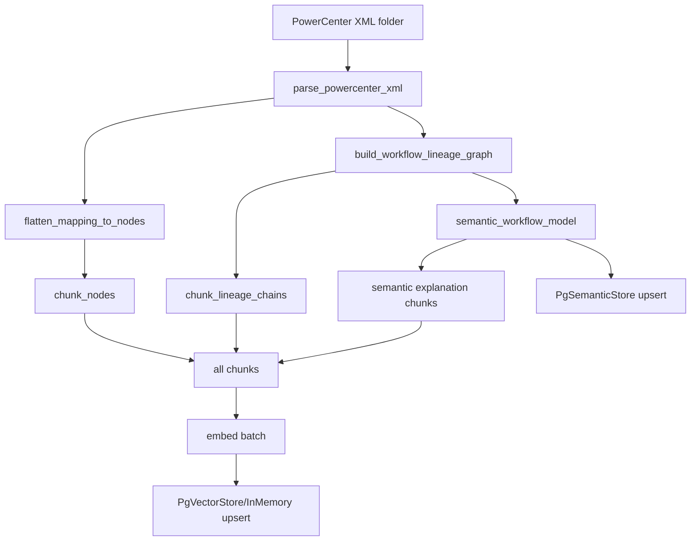
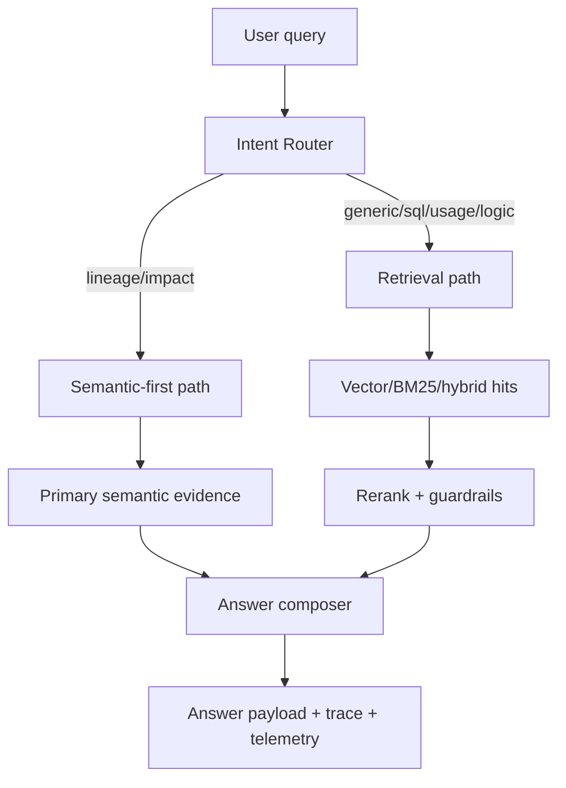

# RAG System Bible: End-to-End + Conceptual + Code Walkthrough

This is a deep, code-cited walkthrough of the `rag-system` project.  
It merges architecture intent (`SYSTEM_E2E_FLOW.md`) with implementation reality in `src/`.

---

## How to Read This (2-Hour Plan)

If you want a full-system understanding in one sitting:

1. **0-20 min**: Sections 1-3 (system posture, architecture map, main flows)
2. **20-60 min**: Sections 4-7 (ingestion, data model, retrieval, semantic truth)
3. **60-90 min**: Sections 8-10 (answer orchestration, observability, chat)
4. **90-115 min**: Sections 11-13 (evaluation, testing, operations)
5. **115-120 min**: Sections 14-15 (tradeoff ledger + interview talking points)

---

## 1) Executive Summary: What This System Is

This project is an Informatica workflow intelligence system with two layers:

1. **Deterministic semantic truth layer** for lineage/impact answers
2. **RAG copilot layer** for natural-language explanation, retrieval, and UX

The key contract is strict:

- For lineage/impact truth claims, the system must rely on semantic evidence.
- If semantic evidence is missing, it refuses instead of hallucinating.

**Primary architecture reference**: [SYSTEM_E2E_FLOW.md](./SYSTEM_E2E_FLOW.md)

---

## 2) Codebase Map (What Owns What)

### Core runtime

- API + orchestration: [src/rag_system/api/app.py](./src/rag_system/api/app.py)
- KB orchestration (ingest/search/semantic model): [src/rag_system/knowledge_base.py](./src/rag_system/knowledge_base.py)

### Ingestion and chunking

- XML parser: [src/rag_system/ingestion/xml_parser.py](./src/rag_system/ingestion/xml_parser.py)
- Folder walker/flattening: [src/rag_system/ingestion/pc_processor.py](./src/rag_system/ingestion/pc_processor.py)
- Lineage chain resolver fallback: [src/rag_system/ingestion/lineage_parser.py](./src/rag_system/ingestion/lineage_parser.py)
- Chunker: [src/rag_system/chunking/chunker.py](./src/rag_system/chunking/chunker.py)

### Retrieval + stores

- Embedding providers: [src/rag_system/embeddings/provider.py](./src/rag_system/embeddings/provider.py)
- Vector store + BM25 + hybrid: [src/rag_system/store/vector_store.py](./src/rag_system/store/vector_store.py)
- Semantic relational store: [src/rag_system/store/semantic_store.py](./src/rag_system/store/semantic_store.py)
- NetworkX lineage engine: [src/rag_system/lineage/networkx_lineage.py](./src/rag_system/lineage/networkx_lineage.py)
- Cross-encoder reranker: [src/rag_system/reranking/cross_encoder.py](./src/rag_system/reranking/cross_encoder.py)

### Answer graph + prompts

- LangGraph state machine: [src/rag_system/graph/answer_graph.py](./src/rag_system/graph/answer_graph.py)
- Prompt loader/versioning: [src/rag_system/prompts/__init__.py](./src/rag_system/prompts/__init__.py)

### Evaluation + quality gates

- Retrieval eval harness: [src/rag_system/eval/retrieval_eval.py](./src/rag_system/eval/retrieval_eval.py)
- RAGAS eval harness: [src/rag_system/eval/ragas_eval.py](./src/rag_system/eval/ragas_eval.py)
- Quality drop gate: [src/rag_system/eval/quality_gate.py](./src/rag_system/eval/quality_gate.py)

### Validation tests

- Smoke tests (offline/in-process): [tests/test_smoke.py](./tests/test_smoke.py)

## 2.1 Code citation index (line anchors)

Use these as implementation anchors while reading source:

| Capability | Anchor |
|---|---|
| Trace envelope creation | `app.py:_new_trace_payload` ([src/rag_system/api/app.py](./src/rag_system/api/app.py), around line 278) |
| Answer usage telemetry normalization | `app.py:_answer_usage_telemetry` ([src/rag_system/api/app.py](./src/rag_system/api/app.py), around line 302) |
| Event lifecycle logging | `app.py:_answer_event_log` ([src/rag_system/api/app.py](./src/rag_system/api/app.py), around line 320) |
| Connect existing indexed corpus | `app.py:_run_connect` ([src/rag_system/api/app.py](./src/rag_system/api/app.py), around line 625) |
| Full ingest/rebuild | `app.py:_run_ingest` ([src/rag_system/api/app.py](./src/rag_system/api/app.py), around line 659) |
| Intent classifier chain | `_infer_query_intent*` ([src/rag_system/api/app.py](./src/rag_system/api/app.py), around lines 1242, 1275, 1348) |
| Retrieval planner + guardrails | `app.py:_retrieve_hits` ([src/rag_system/api/app.py](./src/rag_system/api/app.py), around line 2080) |
| Refusal thresholding | `_score_and_threshold`, `_insufficient_evidence` ([src/rag_system/api/app.py](./src/rag_system/api/app.py), around lines 2505, 2522) |
| Semantic-primary answer path | `_maybe_answer_from_semantic_layer` ([src/rag_system/api/app.py](./src/rag_system/api/app.py), around line 2761) |
| Retrieval answer synthesis | `_build_answer_payload_from_retrieval` ([src/rag_system/api/app.py](./src/rag_system/api/app.py), around line 3130) |
| Legacy and graph answer entrypoints | `_answer_legacy`, `_answer_graph` ([src/rag_system/api/app.py](./src/rag_system/api/app.py), around lines 3377, 3461) |
| Graph state contract | `AnswerGraphState` ([src/rag_system/graph/answer_graph.py](./src/rag_system/graph/answer_graph.py), around line 16) |
| Graph execution loop | `run_answer_graph` ([src/rag_system/graph/answer_graph.py](./src/rag_system/graph/answer_graph.py), around line 52) |
| Semantic model assembly | `_build_semantic_workflow_model` ([src/rag_system/knowledge_base.py](./src/rag_system/knowledge_base.py), around line 102) |
| Deterministic lineage/impact query API | `query_semantic_lineage`, `query_semantic_impact` ([src/rag_system/knowledge_base.py](./src/rag_system/knowledge_base.py), around lines 406, 487) |
| Semantic explanation artifacts | `_build_semantic_explanation_chunks` ([src/rag_system/knowledge_base.py](./src/rag_system/knowledge_base.py), around line 780) |
| Ingestion orchestrator | `build_from_folder` ([src/rag_system/knowledge_base.py](./src/rag_system/knowledge_base.py), around line 995) |
| Vector schema/search/hybrid | `PgVectorStore` methods ([src/rag_system/store/vector_store.py](./src/rag_system/store/vector_store.py), around lines 194, 285, 313, 343) |
| Semantic schema + upsert | `PgSemanticStore` methods ([src/rag_system/store/semantic_store.py](./src/rag_system/store/semantic_store.py), around lines 58, 274) |
| Semantic SQL query implementations | `query_semantic_lineage`, `query_semantic_impact` ([src/rag_system/store/semantic_store.py](./src/rag_system/store/semantic_store.py), around lines 733, 789) |
| NetworkX deterministic query engine | `query_lineage`, `query_impact` ([src/rag_system/lineage/networkx_lineage.py](./src/rag_system/lineage/networkx_lineage.py), around lines 579, 725) |
| Prompt registry loader | prompt loader methods ([src/rag_system/prompts/__init__.py](./src/rag_system/prompts/__init__.py), lines 37-75) |
| Prompt definitions | [prompts/prompts.yml](./prompts/prompts.yml) |

---

## 3) End-to-End System Flows

## 3.1 Build/ingest flow



Implemented in [InformaticaKnowledgeBase.build_from_folder](./src/rag_system/knowledge_base.py).

## 3.2 Query/answer flow



Implemented in [app.py](./src/rag_system/api/app.py), especially:

- `_maybe_answer_from_semantic_layer`
- `_retrieve_hits`
- `_build_answer_payload_from_retrieval`
- `/answer`

## 3.3 API surface and contracts

The top-level HTTP routes are all declared in [src/rag_system/api/app.py](./src/rag_system/api/app.py) (around lines 725-3796).

| Endpoint | What it does | Core contract |
|---|---|---|
| `GET /health` | Liveness + KB/semantic/graph status | Returns `kb_built`, `chunk_count`, ingest state, semantic and graph snapshots. |
| `GET /lineage/coverage` | Workflow lineage coverage telemetry | Coverage counts per workflow; field lists optional by query param. |
| `GET /semantic/model` | Semantic model snapshot | Returns semantic availability and model summary for indexed workflows. |
| `GET /semantic/lineage` | Deterministic lineage lookup | Requires workflow + field; returns semantic status + paths; includes trace/telemetry. |
| `GET /semantic/impact` | Deterministic impact lookup | Returns impacted targets/mappings + supporting paths; includes trace/telemetry. |
| `POST /connect` | Attach runtime to existing indexed DB | Loads indexed corpus/semantic state without reparsing XML folder. |
| `POST /ingest` | Parse + chunk + embed + persist | Rebuilds corpus from `INFA_XML_FOLDER` and hydrates semantic + graph state. |
| `GET /retrieve` | Retrieval-only debug endpoint | Returns `hits` + mode/plan metadata + trace/telemetry envelope. |
| `GET /answer` | Main answer endpoint | Semantic-primary for lineage/impact; retrieval flow otherwise; refusal-safe by design. |
| `GET /prompts` | Prompt registry metadata | Returns available prompts and versions loaded from `prompts.yml`. |
| `GET /chat/ui` | HTML chat UI page | Returns static chat UI shell. |
| `GET /agent/context` | Capability/inventory snapshot | Returns current indexed capabilities and corpus context summary. |
| `POST /chat/sessions` | Create chat session | Returns `session_id`; persists chat metadata. |
| `GET /chat/sessions/{id}` | Read session metadata | Summary, message counts, and recency metadata. |
| `PUT /chat/sessions/{id}/summary` | Replace compressed memory | Updates summary used for follow-up contextualization. |
| `DELETE /chat/sessions/{id}/summary` | Clear compressed memory | Resets summary context. |
| `GET /chat/sessions/{id}/messages` | Read transcript | Returns ordered chat messages. |
| `POST /chat/sessions/{id}/messages` | Send user message | Runs answer flow with contextualization, then appends assistant reply. |

---

## 4) Ingestion: From XML to Searchable Knowledge

## 4.1 XML parsing (canonical structure)

`xml_parser.py` parses:

- `SOURCE` nodes + fields
- `TARGET` nodes + fields/keys
- `TRANSFORMATION` nodes + ports/attributes/sql override
- `CONNECTOR` edges per mapping

Reference: [parse_powercenter_xml](./src/rag_system/ingestion/xml_parser.py)

### Why this design

- Canonical dict shape keeps parsing independent from indexing backend.
- Easier to test than coupling parsing directly to DB inserts.

### Tradeoff

- Loses some raw XML nuance unless explicitly captured in schema.

## 4.2 Node flattening and file walking

`pc_processor.py`:

- walks folder, detects PowerCenter exports
- parses each XML
- flattens to ordered nodes (SOURCE -> TRANSFORMATION -> TARGET)
- injects `_source_file` and `_xml_path`

Reference: [walk_xml_folder](./src/rag_system/ingestion/pc_processor.py)

## 4.3 Structure-aware chunking

`chunker.py`:

- One canonical node -> one chunk by default
- Large nodes split with overlap (`DEFAULT_MAX_TOKENS=700`, overlap `100`)
- Rich metadata: mapping, type, sql flags, field/port counts, folder, owner, etc.

References:

- [render_node](./src/rag_system/chunking/chunker.py)
- [chunk_node](./src/rag_system/chunking/chunker.py)
- [chunk_nodes](./src/rag_system/chunking/chunker.py)

### Key implementation detail

Chunk IDs include a content hash suffix, reducing collisions across repeated names.

### Tradeoff

- Rich metadata improves filtering and explainability but increases index payload size.

## 4.4 Lineage chains as first-class chunks

Two paths exist:

1. Graph-first lineage derivation (`networkx_lineage.py`)
2. Fallback parser BFS (`lineage_parser.py`) if NetworkX unavailable

Lineage chunks are generated only for resolved paths in [chunk_lineage_chains](./src/rag_system/chunking/chunker.py).

### Tradeoff

- Skipping unresolved chains keeps index cleaner, but hides partial lineage hints from retrieval.

## 4.5 Semantic model generation + explanation artifacts

During build:

- Semantic workflow model is created (`workflow/mappings/nodes/ports/connectors/lineage_paths`)
- Semantic explanation chunks are generated (`SEMANTIC_DEFINITION`) and marked `authoritative=false`

References:

- [InformaticaKnowledgeBase._build_semantic_workflow_model](./src/rag_system/knowledge_base.py)
- [InformaticaKnowledgeBase._build_semantic_explanation_chunks](./src/rag_system/knowledge_base.py)

### Tradeoff

- Explanation chunks help UX and LLM readability, but must never be treated as truth.

---

## 5) Data Model: Truth Layer vs Copilot Layer

## 5.1 Copilot layer (vector table)

`rag.rag_chunks` (in pgvector store):

- `chunk_id`, `source_file`, `node_class`, `name`, `text`, `metadata`, `embedding`
- IVFFlat cosine index for vector search
- Generated `fts` column + GIN index for lexical search

Reference: [PgVectorStore._ensure_schema](./src/rag_system/store/vector_store.py)

## 5.2 Truth layer (semantic relational tables)

`semantic_store.py` creates:

- `semantic_workflows`
- `semantic_mappings`
- `semantic_nodes`
- `semantic_ports`
- `semantic_connectors`
- `semantic_lineage_paths`
- `semantic_lineage_hops`

Reference: [PgSemanticStore._ensure_schema](./src/rag_system/store/semantic_store.py)

### Why this split

- Relational model supports deterministic lineage/impact constraints.
- Vector model supports fuzzy context retrieval.

### Tradeoff

- Dual storage increases complexity and sync responsibilities during ingest.

---

## 6) Retrieval Engine Deep Dive

## 6.1 Embedding provider chain

Provider selection in [get_embedding_provider](./src/rag_system/embeddings/provider.py):

1. Azure OpenAI embeddings (if configured)
2. SentenceTransformer local model
3. Hashing fallback

### Tradeoff

- Great resilience to infra outages.
- But embedding dimension compatibility must be managed across providers.

`PgVectorStore` enforces dimension checks and can optionally recreate table on mismatch (`RAG_RECREATE_TABLE_ON_DIM_MISMATCH`).

## 6.2 Retrieval modes

Supported modes:

- `vector`: pgvector cosine similarity
- `bm25`: PostgreSQL FTS + `ts_rank`
- `hybrid`: RRF fusion of vector + BM25
- `auto`: planner/heuristic resolves actual mode

References:

- [PgVectorStore.search](./src/rag_system/store/vector_store.py)
- [PgVectorStore.search_bm25](./src/rag_system/store/vector_store.py)
- [PgVectorStore.search_hybrid](./src/rag_system/store/vector_store.py)
- [_retrieve_hits](./src/rag_system/api/app.py)

## 6.3 Intent-aware retrieval behavior

Intent routing in [app.py](./src/rag_system/api/app.py):

- `_infer_query_intent_heuristic`
- `_infer_query_intent_with_openai`
- `_infer_query_intent`

Special behavior:

- SQL qualifier intent forces lexical/transformation-friendly behavior.
- Source-file hints (`wf_*.xml`) can enforce scoped retrieval.
- Usage queries can entity-fallback (`where is X used`) to avoid drift.
- Lineage anchor terms can filter out irrelevant hits.

## 6.4 Reranking and guardrails

Reranker: [reranking/cross_encoder.py](./src/rag_system/reranking/cross_encoder.py)

Guardrail patterns in `_retrieve_hits`:

- If rerank drops usage entity hits, restore pre-rerank entity hits.
- If rerank drops lineage-anchor hits, restore pre-rerank anchor hits.

### Tradeoff

- Guardrails preserve correctness signals but reduce pure reranker authority.

---

## 7) Semantic-First Lineage and Impact Queries

## 7.1 Semantic query order

For lineage/impact in `knowledge_base.py`:

1. Try NetworkX graph query
2. Fallback to semantic PostgreSQL query
3. Fallback to in-memory semantic model

References:

- [query_semantic_lineage](./src/rag_system/knowledge_base.py)
- [query_semantic_impact](./src/rag_system/knowledge_base.py)

## 7.2 Semantic status contract

Typical statuses:

- `ok`
- `workflow_not_indexed`
- `field_not_found`
- `graph_unavailable` (graph path only)

These statuses drive refusal logic in `/answer`.

## 7.3 Cross-workflow lineage

NetworkX engine builds canonical field identity nodes (`field::<norm>`) for cross-workflow tracing when workflow hint is absent.

Reference: [LineageNetworkXEngine](./src/rag_system/lineage/networkx_lineage.py)

### Tradeoff

- Cross-workflow support is powerful but can over-broaden result sets without strong field anchors.

---

## 8) Answer Generation: Semantic Primary + Retrieval Copilot

## 8.1 Semantic-primary path

Implemented in `_maybe_answer_from_semantic_layer`:

- activates only for lineage/impact intent
- extracts workflow hints and field anchors
- queries semantic layer
- refuses deterministically if semantic proof missing
- optionally adds secondary vector context (non-authoritative)

References:

- [_maybe_answer_from_semantic_layer](./src/rag_system/api/app.py)
- [_semantic_refusal_payload](./src/rag_system/api/app.py)
- [_render_semantic_primary_answer](./src/rag_system/api/app.py)

## 8.2 Retrieval answer path

If not semantic-primary:

1. retrieve hits via `_retrieve_hits`
2. apply refusal threshold checks
3. build evidence blocks
4. render prompt template
5. call LLM (optional)
6. apply grounded fallback/relevancy rewrite if needed

Reference: [_build_answer_payload_from_retrieval](./src/rag_system/api/app.py)

## 8.3 Refusal policy

`_insufficient_evidence` compares top score against mode-specific thresholds.

- hybrid mode uses `vector_score` when available
- returns explicit refusal payload on low confidence

Reference: [_score_and_threshold](./src/rag_system/api/app.py)

### Tradeoff

- Safer than always-answer behavior.
- Requires calibration to avoid over-refusal on edge cases.

## 8.4 Prompting contract and versioning

Prompts are versioned in [prompts/prompts.yml](./prompts/prompts.yml) and loaded by
[src/rag_system/prompts/__init__.py](./src/rag_system/prompts/__init__.py).

Current roles:

- `answer_with_citations`: strict evidence-only answer synthesis
- `planner_rewrite`: retrieval rewrite + mode/node hints
- `answer_executor`: graph executor answer drafting
- `answer_validator`: graph validator decision schema

This gives prompt governance without hardcoding prompt text in API logic.

---

## 9) Orchestration Modes: Legacy vs Graph

## 9.1 Legacy mode

Direct function orchestration in `_answer_legacy`.

## 9.2 Graph mode

LangGraph planner -> executor -> validator loop:

- planner: retrieval
- executor: answer payload build
- validator: pass/retry/fail decision (with retry cap)

References:

- [run_answer_graph](./src/rag_system/graph/answer_graph.py)
- [_answer_graph](./src/rag_system/api/app.py)

### Critical implementation insight

Graph state must explicitly carry handoff fields (hits, plan, resolved_mode, etc.) in `AnswerGraphState`.

---

## 10) Observability and Telemetry Contract

Week +1 instrumentation is response-level and additive.

Each key route includes:

- `trace`:
  - `request_id`
  - `endpoint`
  - `timestamp_utc`
  - optional query/intent/workflow/orchestration
- `telemetry`:
  - `timing_ms` stage timings
  - `events` lifecycle statuses
  - `usage` placeholders (`prompt_tokens`, etc., or explicit unavailable reason)

References:

- [_new_trace_payload](./src/rag_system/api/app.py)
- [_answer_usage_telemetry](./src/rag_system/api/app.py)
- [_answer_event_log](./src/rag_system/api/app.py)
- `/retrieve`, `/answer`, `/semantic/*`, `/lineage/coverage` in [app.py](./src/rag_system/api/app.py)

### Tradeoff

- Additive telemetry avoids behavior coupling, but cannot replace full distributed tracing/APM.

## 10.1 Telemetry semantics (how to read it)

- `timing_ms.total_ms`: end-to-end route time for the request
- stage fields (`retrieval_ms`, `rerank_ms`, `semantic_ms`, `llm_ms`, etc.): internal phase slices
- `events`: lifecycle path markers useful for debugging branch decisions
- `usage`: token accounting when available, otherwise explicit placeholder reason

Debugging rule of thumb:

1. `total_ms` high + `retrieval_ms` high -> corpus/index/search bottleneck
2. `total_ms` high + `llm_ms` high -> model latency bottleneck
3. Refusal with low `retrieval_ms` and low top score -> evidence quality/relevance issue
4. Semantic-primary refusal with normal `semantic_ms` -> deterministic miss, not latency

## 10.2 Code-level mini examples (logic patterns)

### A) Semantic query fallback order

```python
# knowledge_base.py (conceptualized from query_semantic_lineage/query_semantic_impact)
try networkx query
if unavailable/empty -> try semantic SQL store
if store unavailable -> try in-memory semantic model
return explicit semantic status (ok/not_indexed/field_not_found/...)
```

### B) Retrieval rerank guardrail intent

```python
# app.py (_retrieve_hits)
hits_before_rerank = hits
hits_after_rerank = rerank(hits_before_rerank)
if rerank dropped usage entity anchors:
    restore anchored hits from pre-rerank list
if rerank dropped lineage anchors:
    restore anchored lineage hits from pre-rerank list
```

### C) Refusal gate intent

```python
# app.py (_insufficient_evidence)
score, threshold = _score_and_threshold(hits, mode)
if score < threshold:
    return refusal_payload(reason="insufficient_evidence")
```

---

## 11) Chat and Memory Subsystem

The API includes a sessioned chat layer backed by SQLite.

Core behaviors:

- Create session, append messages, store summary
- Follow-up contextualization from recent turns + summary
- Capability-inventory subflow for onboarding prompts
- Graph/legacy orchestration available in chat route too

References:

- Chat DB helpers in [app.py](./src/rag_system/api/app.py): `_chat_db_*`, `_persist_*`, `_load_chat_session_from_db`
- Chat endpoints `/chat/sessions*` in [app.py](./src/rag_system/api/app.py)

### Tradeoff

- SQLite gives low-complexity persistence for single-instance/local usage.
- Multi-instance horizontal scale would require shared state backend migration.

---

## 12) Evaluation and Quality Controls

## 12.1 Retrieval eval harness

`retrieval_eval.py` evaluates `/retrieve` against JSONL matchers using:

- recall@k
- nDCG@k
- per-bucket summaries

Reference: [run_eval](./src/rag_system/eval/retrieval_eval.py)

## 12.2 Answer-level RAGAS eval

`ragas_eval.py`:

- calls `/answer` for each dataset row
- computes `faithfulness` and `answer_relevancy`
- supports graph/legacy and relevancy-boost toggles
- validates modern response contract

Reference: [run_eval](./src/rag_system/eval/ragas_eval.py)

## 12.3 Quality regression gate

`quality_gate.py` checks metric drops vs baseline (e.g., faithfulness max drop).

Reference: [evaluate_drop_gate](./src/rag_system/eval/quality_gate.py)

### Tradeoff

- Strong governance, but over-tight thresholds can slow iteration during active model/prompt tuning.

---

## 13) Testing Strategy

Primary confidence suite is `tests/test_smoke.py`:

- offline chunking + embedding + in-memory store behavior
- semantic lineage/impact contract behavior
- endpoint-level response structure
- graph mode toggles
- chat session behavior and follow-ups
- telemetry fields on key endpoints

Reference: [tests/test_smoke.py](./tests/test_smoke.py)

### Why this matters

- Fast, deterministic smoke tests protect core contracts without external infra.

### Gap

- True production behavior (real pgvector, real Azure/OpenAI, real corpus size) still needs integration/perf environments.

---

## 14) Operational Runbook (How to Think in Prod)

## 14.1 Startup and readiness

Use:

- `GET /health` for kb state + chunk count + semantic + lineage graph snapshot
- `POST /connect` when DB already indexed and service restarted
- `POST /ingest` for rebuild

References:

- [health endpoint](./src/rag_system/api/app.py)
- [_run_connect](./src/rag_system/api/app.py)
- [_run_ingest](./src/rag_system/api/app.py)

## 14.2 Deterministic failure modes

For lineage/impact:

- missing workflow hint (if scope required) -> refusal
- missing field anchor -> refusal
- workflow not indexed -> refusal
- field unresolved -> refusal

This is intentional safety behavior, not a bug.

## 14.3 Retrieval failure modes

- empty/weak evidence -> refusal by threshold
- reranker unavailable -> fallback to retrieval-only ordering
- planner failure -> heuristic fallback

---

## 15) Tradeoff Ledger (Senior-Level View)

## 15.1 Semantic truth + retrieval copilot split

**Win**: strong correctness boundary for lineage/impact  
**Cost**: dual-plane complexity (semantic + vector consistency)

## 15.2 Graph-first lineage runtime

**Win**: deterministic traversal and cross-workflow identity support  
**Cost**: extra state structures and query-path complexity

## 15.3 Rich metadata chunking

**Win**: better filters, guardrails, explainability  
**Cost**: larger payload/index storage and metadata upkeep

## 15.4 Additive observability envelope

**Win**: debuggability without contract coupling  
**Cost**: partial observability (good response-level telemetry, not full distributed tracing)

## 15.5 Multi-tier answer fallback

**Win**: resilience under LLM failures and empty outputs  
**Cost**: more branches and harder-to-reason behavior if not covered by tests

---

## 16) Concrete API Examples

## 16.1 Deterministic lineage query

```http
GET /semantic/lineage?workflow=wf_4202_fnd_rltinteraction.XML&field=INTERACTION_ID&limit=10
```

Expected shape:

```json
{
  "query": {"workflow": "...", "field": "...", "limit": 10},
  "result": {"status": "ok", "paths": [...]},
  "trace": {"request_id": "...", "endpoint": "/semantic/lineage"},
  "telemetry": {"timing_ms": {"total_ms": 12, "semantic_ms": 8}}
}
```

## 16.2 Retrieval with telemetry

```http
GET /retrieve?q=SQL override Teradata&k=5&mode=hybrid&rerank=true
```

Expected shape:

```json
{
  "effective_query": "...",
  "mode": "hybrid",
  "hits": [...],
  "trace": {"endpoint": "/retrieve", "...": "..."},
  "telemetry": {"timing_ms": {"retrieval_ms": 18, "rerank_ms": 31, "total_ms": 56}}
}
```

## 16.3 Semantic-primary answer

```http
GET /answer?q=Show lineage for INTERACTION_ID in wf_4202_fnd_rltinteraction.XML&llm=false
```

Expected behavior:

- `orchestration_mode=semantic_primary`
- semantic evidence first
- refusal only when deterministic evidence missing

Reference test: [test_answer_lineage_routes_semantic_primary](./tests/test_smoke.py)

---

## 17) Architecture Risks and Improvement Backlog

High-value next steps:

1. Stronger perf benchmark harness (p50/p95/p99 by route and mode)
2. Multi-instance chat state backend (Postgres/Redis) for horizontal scale
3. Explicit cache layer for semantic query hot paths
4. Formal contract tests for trace/telemetry schema
5. Automated semantic-vs-vector consistency audits after ingest
6. Better lineage unresolved diagnostics and repair suggestions

---

## 18) Interview-Ready Positioning (for Senior AI Engineer)

If asked “what is special about this system?”:

> We separated deterministic truth from generative convenience.  
> Lineage/impact answers are semantic-first and refusal-safe, while retrieval/LLM stay in a bounded copilot role.  
> We reinforced this with guardrails, parity checks, and additive observability so production debugging does not compromise correctness boundaries.

---

## 19) References

- Architecture posture: [SYSTEM_E2E_FLOW.md](./SYSTEM_E2E_FLOW.md)
- Conceptual summary predecessor: [CONCEPTUAL_BIBLE.md](./CONCEPTUAL_BIBLE.md)
- API testing guide: [API_TESTING.md](./API_TESTING.md)
- Changelog timeline: [CHANGELOG.md](./CHANGELOG.md)
