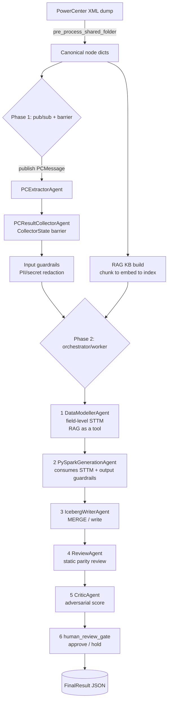
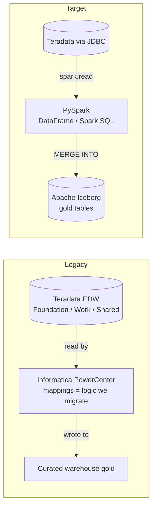

# Project1 — Master Tracker (Agentic Informatica → PySpark)

> **What this is:** the single source of truth for everything built on project1.
> Maintained per-day, with phase status tables, architecture diagrams, and detailed methods.
> Reuse this exact layout for the next project so progress stays comparable.
>
> **Stack:** Teradata EDW → Informatica PowerCenter (XML exports) → **AutoGen agents** →
> **PySpark + Apache Iceberg** lakehouse. RAG grounding (pgvector), guardrails, evaluation,
> adversarial critic, human-in-the-loop.
>
> **Deep-dive doc:** [docs/CODEBASE_TEXTBOOK.md](docs/CODEBASE_TEXTBOOK.md)
> **Concepts:** [architecture/03-rag-eval-guardrails.md](architecture/03-rag-eval-guardrails.md)

---

## 0 — Daily Log

| Date | Focus | Outcome |
|------|-------|---------|
| 2026-06-25 | Real RAG (chunk+embed+pgvector), field-level STTM modeller, prod eval, textbook | ✅ E2E live run validated (1189 chunks, STTM produced, critic flagged, human gate held) |
| 2026-06-25 | Observability — per-step artifact recorder + Langfuse tracing | ✅ Every step persisted to `runs/`; Langfuse tracer with no-op fallback; 20/20 tests pass |

---

## 1 — System at a Glance

---

## 2 — Data Lineage (why Iceberg)

- **Source = Teradata** (`DATABASETYPE="Teradata"`, `OWNERNAME=FND_EINTR_DB`). The `Oracle`
  `RS_EDW_PROD` is only PowerCenter's metadata catalog, not the data.
- **Iceberg** gives the data lake ACID `MERGE`/upsert, schema evolution, hidden partitioning, and
  time-travel snapshots — needed to faithfully port Informatica Update Strategy + parity-test.

---

## 3 — Phase Status

### Phase 1 — Agentic Foundation (AutoGen)
| # | Task | Status | Method / Notes |
|---|------|--------|----------------|
| 1.1 | XML parser (multi-FOLDER aware) | ✅ Done | [utils/xml_parser.py](app/utils/xml_parser.py) — aggregates sources/targets/mappings across `<FOLDER>` |
| 1.2 | Flatten mapping → canonical nodes | ✅ Done | [utils/pc_file_processor.py](app/utils/pc_file_processor.py) `flatten_mapping_to_nodes` ordered SOURCE→TRANSFORMATION→TARGET |
| 1.3 | Topics + typed contracts | ✅ Done | [communication/pyspark_topics.py](app/communication/pyspark_topics.py), [pyspark_types.py](app/communication/pyspark_types.py) |
| 1.4 | Extractor (pub/sub, soft-fail) | ✅ Done | [agents/pc_extractor_agent.py](app/agents/pc_extractor_agent.py) `@type_subscription` |
| 1.5 | Collector barrier | ✅ Done | [agents/result_collector_agent.py](app/agents/result_collector_agent.py) — `set_expected_count` BEFORE publish |
| 1.6 | Orchestrator/worker flow | ✅ Done | [agents/orchestrator_agent.py](app/agents/orchestrator_agent.py) 6-step → `FinalResult` |
| 1.7 | Runtime wiring | ✅ Done | [orchestrators/pyspark_codegen_workflow.py](app/orchestrators/pyspark_codegen_workflow.py) |

### Phase 2 — Prompts & Config
| # | Task | Status | Method / Notes |
|---|------|--------|----------------|
| 2.1 | PE-upgraded prompts | ✅ Done | role priming, delimited sections, schema-first JSON, decision tables — [prompt_engineering/prompts/](app/prompt_engineering/prompts/) |
| 2.2 | Azure client (gpt-5 family aware) | ✅ Done | [config/azure_openai.py](app/config/azure_openai.py) — omits temp/seed for gpt-5; pins them for gpt-4o |
| 2.3 | CLI + smoke runs | ✅ Done | [run.py](app/run.py) `--limit`, `--human` |

### Phase 3 — RAG (chunk → embed → index → retrieve)
| # | Task | Status | Method / Notes |
|---|------|--------|----------------|
| 3.1 | Chunking (strategies documented) | ✅ Done | [rag/chunking.py](app/rag/chunking.py) — **structure-aware** (1 node = 1 chunk) + size-bounded overlap fallback |
| 3.2 | Embeddings (2 providers) | ✅ Done | [rag/embeddings.py](app/rag/embeddings.py) — `AzureOpenAIEmbedding` + deterministic `HashingEmbedding` (L2-norm) |
| 3.3 | Vector store (in-mem + pgvector) | ✅ Done | [rag/vector_store.py](app/rag/vector_store.py) — `<=>` cosine + IVFFlat; own `rag` schema |
| 3.4 | Knowledge base + RAG-as-tool | ✅ Done | [rag/knowledge_base.py](app/rag/knowledge_base.py) — `build_from_folder`, `as_tool()` |

### Phase 4 — Modelling, Codegen, Iceberg
| # | Task | Status | Method / Notes |
|---|------|--------|----------------|
| 4.1 | Field-level STTM modeller | ✅ Done | [agents/data_modeller_agent.py](app/agents/data_modeller_agent.py) — RAG tool queries → `source_to_target` rows |
| 4.2 | STTM threaded into generation | ✅ Done | orchestrator → `gen_meta` → [agents/pyspark_generation_agent.py](app/agents/pyspark_generation_agent.py) |
| 4.3 | Iceberg writer (MERGE) | ✅ Done | [agents/iceberg_writer_agent.py](app/agents/iceberg_writer_agent.py) |

### Phase 5 — Safety, Eval, Human-in-the-loop
| # | Task | Status | Method / Notes |
|---|------|--------|----------------|
| 5.1 | Guardrails (input + output) | ✅ Done | [guardrails/engine.py](app/guardrails/engine.py) — PII/Secrets/Injection in; DestructiveSQL/Schema/SQLFidelity out |
| 5.2 | Offline eval metrics | ✅ Done | [evaluation/metrics.py](app/evaluation/metrics.py) — rouge_n/l, token_f1, AST parse, ref-check |
| 5.3 | Production eval strategies | ✅ Done | [evaluation/prod_strategies.py](app/evaluation/prod_strategies.py) — embedding sim, execution parity, LLM judge, scorecard |
| 5.4 | Adversarial critic | ✅ Done | [agents/critic_agent.py](app/agents/critic_agent.py) — verdict + `requires_human_review` (<0.85) |
| 5.5 | Human gate | ✅ Done | [agents/human_gate.py](app/agents/human_gate.py) — auto / interactive |

### Phase 6 — Validation & Docs
| # | Task | Status | Method / Notes |
|---|------|--------|----------------|
| 6.1 | Offline test suite | ✅ Done | `tests/test_rag_guardrails_eval.py` — 20/20 pass (backend=memory) |
| 6.2 | Live E2E run | ✅ Done | `python -m app.run --limit 3` — see §4 trace |
| 6.3 | Textbook walkthrough | ✅ Done | [docs/CODEBASE_TEXTBOOK.md](docs/CODEBASE_TEXTBOOK.md) |
| 6.4 | Master tracker (this file) | ✅ Done | — |

### Phase 7 — Observability (per-step persistence + tracing)
| # | Task | Status | Method / Notes |
|---|------|--------|----------------|
| 7.1 | Per-step run recorder | ✅ Done | [observability/run_recorder.py](app/observability/run_recorder.py) — writes `runs/<ts>_<mapping>/` (parsed/redacted nodes, RAG context+hits, every LLM input/output, final result, manifest) |
| 7.2 | Langfuse tracing (no-op fallback) | ✅ Done | [observability/tracing.py](app/observability/tracing.py) — `build_tracer()`; trace/run, generation/LLM-call, events; silent no-op without `LANGFUSE_*` keys |
| 7.3 | Instrumented client (zero agent edits) | ✅ Done | [observability/instrumented_client.py](app/observability/instrumented_client.py) — proxy labels each `.create()` by step; delegates via `__getattr__` |
| 7.4 | Workflow wiring + flags | ✅ Done | [orchestrators/pyspark_codegen_workflow.py](app/orchestrators/pyspark_codegen_workflow.py) (`record`/`trace` params); [run.py](app/run.py) `--no-record`/`--no-trace`; `runs/` gitignored |

---

## 4 — Validated Live Run (2026-06-25)

`python -m app.run --limit 3` on `m_4202_dt_chn_rltinteractionagreement`:

| Stage | Evidence |
|-------|----------|
| Pre-process | 3 canonical nodes |
| RAG index | **1189 chunks** in `rag.rag_chunks` (pgvector, dim=256); retrieved 4014 chars cross-file |
| Barrier | 3/3 extraction responses collected, then released |
| Data Modeller | gathered 3 RAG chunks via tool → produced STTM (`source_to_target` rows + model) |
| Generation | 3 PySpark node fragments built from STTM |
| Iceberg | MERGE write statement produced |
| Review → Critic | critic confidence **0.22**, listed blocking issues |
| Human gate | **HELD for review** (correct — defects present) |
| Output | `generated/m_4202_dt_chn_rltinteractionagreement.result.json` |

> The critic correctly caught real defects (missing MERGE staging, `EIntrSource_Cd` key
> mismatch, hardcoded JDBC creds, `UPDATE SET *` wildcards) and routed to a human — the
> machine-validates-then-human flow working as designed.

---

## 5 — Key Methods / Decisions Log

| Date | Topic | Decision / Method |
|------|-------|-------------------|
| 2026-06-25 | Chunking strategy | **Structure-aware** (1 Informatica node = 1 chunk); fallback = size-bounded split with overlap. Rejected fixed/sliding/sentence/semantic (see textbook §5.1) |
| 2026-06-25 | Embeddings offline | Deterministic `HashingEmbedding` (feature-hash trick) so tests/air-gap exercise the real NN path |
| 2026-06-25 | Vector backend | `RAG_BACKEND` env: `pgvector` (Azure Postgres) or `memory`; graceful fallback |
| 2026-06-25 | Azure Postgres perms | Non-admin **cannot** `CREATE EXTENSION` (admin pre-installs; check `pg_extension` first) and lacks `public` CREATE → use own **`rag` schema**; batch `executemany` (row-by-row over VPN hung) |
| 2026-06-25 | Modeller output | Field-level **STTM** is the authoritative contract for codegen, not a vague blob |
| 2026-06-25 | RAG usage | RAG **as a tool** — modeller actively queries KB with targeted questions |
| 2026-06-25 | Data source truth | Source = **Teradata**; `Oracle RS_EDW_PROD` is only the metadata catalog |
| 2026-06-25 | Observability design | Wrap the model client per agent (`InstrumentedChatClient`) → record + trace every LLM call with **zero agent edits**; recorder + tracer are best-effort (never break the run) |
| 2026-06-25 | Tracing dependency | Langfuse is **optional** — no-op unless SDK installed *and* `LANGFUSE_*` keys set; keeps offline/CI runs green |
| 2026-06-25 | Framework choice | **AutoGen, not LangChain**: this is a multi-agent coordination problem (typed message-passing, pub/sub + send, barrier, human gate) — AutoGen's actor/runtime model is native; LangChain is an LLM-chain/RAG toolkit where multi-agent is an add-on (LangGraph). See textbook §2.2 |
| — | Secrets | `.env` gitignored; **rotate the demo Postgres password** (was exposed in chat) |

---

## 6 — Open / Next (Production Hardening)

| # | Task | Status | Notes |
|---|------|--------|-------|
| N.1 | Observability/tracing | ✅ Done | Langfuse tracer + per-step recorder (Phase 7) |
| N.2 | Token/cost accounting | 🔄 In Progress | LLM usage (prompt/completion tokens) captured per call in `runs/` + Langfuse; per-run rollup TBD |
| N.3 | Retries + rate-limit + DLQ | ⬜ Not Started | resilience for batch runs |
| N.4 | Scheduled re-indexing | ⬜ Not Started | embedding model + cron refresh of KB |
| N.5 | Data lineage | ⬜ Not Started | OpenLineage emission |
| N.6 | CI eval gate | ⬜ Not Started | wire `evaluation/` to fail PRs on regression |
| N.7 | Execution parity harness | ⬜ Not Started | run gen vs golden on sample data (scaffold exists) |
| N.8 | Containerize + Helm/CI-CD | ⬜ Not Started | deploy to AKS |
| N.9 | Rotate exposed Postgres credential | 🚫 Blocked | security — do this first |

---

## Status Key
| Symbol | Meaning |
|--------|---------|
| ⬜ Not Started | Not yet begun |
| 🔄 In Progress | Actively working |
| ✅ Done | Complete |
| 🚫 Blocked | Waiting on dependency |
| ⏭️ Skipped | Out of scope |
