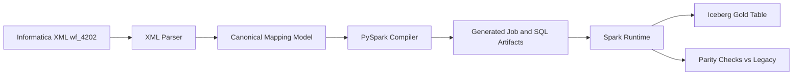
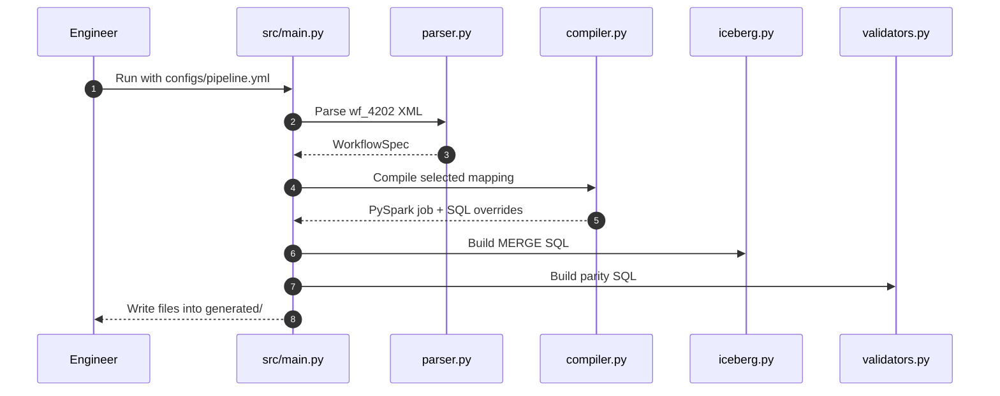

# E2E Architecture Diagrams - wf_4202_fnd_rltinteraction

## End-to-End Reverse Engineering Pipeline

```mermaid
flowchart LR
    A[Informatica XML wf_4202] --> B[XML Parser]
    B --> C[Canonical Mapping Model]
    C --> D[PySpark Compiler]
    D --> E[Generated Job and SQL Artifacts]
    E --> F[Spark Runtime]
    F --> G[Iceberg Gold Table]
    F --> H[Parity Checks vs Legacy]
```

## Artifact Generation Sequence

```mermaid
sequenceDiagram
    autonumber
    participant Dev as Engineer
    participant Main as src/main.py
    participant Parser as parser.py
    participant Compiler as compiler.py
    participant Iceberg as iceberg.py
    participant Validators as validators.py

    Dev->>Main: Run with configs/pipeline.yml
    Main->>Parser: Parse wf_4202 XML
    Parser-->>Main: WorkflowSpec
    Main->>Compiler: Compile selected mapping
    Compiler-->>Main: PySpark job + SQL overrides
    Main->>Iceberg: Build MERGE SQL
    Main->>Validators: Build parity SQL
    Main-->>Dev: Write files into generated/
```
