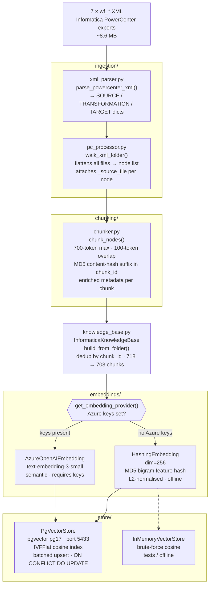
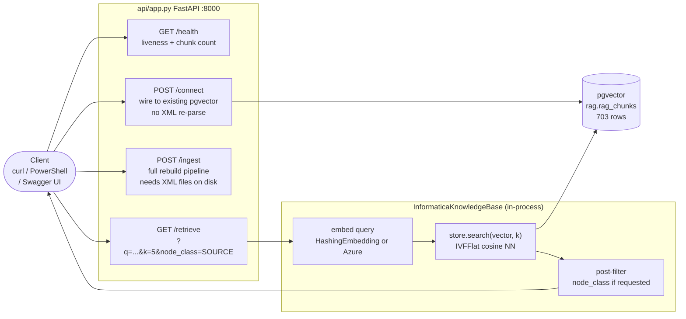

# S01 — 2026-08-11 — RAG System: Ingestion + Chunking + Index + API

## Architecture

### Ingestion Pipeline



### Retrieval Flow



---

## Goal
Bootstrap a standalone, testable RAG system over the 7 Informatica PowerCenter XML exports (`app_CALCULATE_EINTERACTION`) and expose it as a FastAPI service backed by pgvector.

## Delivered

### Corpus ingestion
- `ingestion/xml_parser.py`: parses PowerCenter XML → canonical node dicts (SOURCE / TRANSFORMATION / TARGET)
- `ingestion/pc_processor.py`: walks all 7 `wf_*.XML` files, attaches `_source_file` metadata per node
- 460 canonical nodes extracted from ~8.6 MB of XML

### Chunking
- `chunking/chunker.py`: structure-aware chunking — 700-token max, 100-token overlap on splits
- Chunk ID includes content hash to prevent collisions from same node name across FOLDER elements
- Enriched metadata per chunk: `source_db`, `has_sql_override`, `has_join`, `has_filter`, `field_count`, `port_count`, `primary_key_count`, `folder`

### Embeddings
- `embeddings/provider.py`: `HashingEmbedding` (offline, dim=256) + `AzureOpenAIEmbedding` (production)
- `get_embedding_provider()` auto-selects: Azure if keys are set, hashing otherwise
- **HashingEmbedding approach**: MD5-hashes unigram + bigram token features into 256 buckets, L2-normalised. No model download, fully deterministic. Trade-off: lexical only (not semantic).

### Vector store
- `store/vector_store.py`: `InMemoryVectorStore` (tests) + `PgVectorStore` (pgvector IVFFlat cosine index, batched upsert, ON CONFLICT DO UPDATE for idempotent re-ingest)

### Knowledge base
- `knowledge_base.py`: `build_from_folder()` — parse → chunk → dedup → embed → upsert; `search(query, k, filter_node_class)`
- Deduplication: 718 generated chunks → **703 unique chunks** (15 identical content nodes removed)

### API
- `api/app.py`: FastAPI service
  - `GET /health` — liveness + KB state + chunk count
  - `POST /ingest` — (re)parse XMLs and rebuild index (background or blocking)
  - `POST /connect` — wire to existing pgvector data without re-parsing (use on server restart)
  - `GET /retrieve?q=...&k=5&node_class=SOURCE` — semantic search
- `AUTO_CONNECT=true` in `.env` wires to pgvector on startup

### Infrastructure
- `docker-compose.yml`: `pgvector/pgvector:pg17` on port 5433, named volume, `pg_isready` healthcheck

### Tests
- `tests/test_smoke.py`: 14 offline tests — chunker, embeddings (shape, L2-norm, determinism), InMemoryVectorStore, KB search, FastAPI endpoints
- `tests/test_integration.py`: 16 tests against real XML corpus; auto-skips when OneDrive offline
- **30/30 tests pass**

## Real Examples — What Actually Lives in pgvector

### pgvector table schema (`rag.rag_chunks`)

```sql
CREATE TABLE rag.rag_chunks (
    chunk_id    TEXT PRIMARY KEY,   -- "wf_4201.XML:TRANSFORMATION:SQ_SQL...:0e1edc3c#0"
    source_file TEXT,               -- "wf_4201_calculate_interaction_facts.XML"
    node_class  TEXT,               -- SOURCE | TRANSFORMATION | TARGET
    name        TEXT,               -- "SQ_SQL_Override_InteractionEvent"
    text        TEXT,               -- full rendered text (what the embedding model sees)
    metadata    JSONB,              -- filterable: type, has_sql_override, has_join, ...
    embedding   vector(384)         -- all-MiniLM-L6-v2 semantic vector
);
```

---

### Example A — Small Source Qualifier (12 ports → 1 chunk)

A compact Source Qualifier that fits inside 700 tokens becomes a single, self-contained chunk.

**chunk_id:** `wf_4201_calculate_interaction_facts.XML:TRANSFORMATION:SQ_SQL_Override_InteractionEvent:0746a6f6#0`

**text stored in pgvector:**
```
FILE: wf_4201_calculate_interaction_facts.XML
NODE_CLASS: TRANSFORMATION
NAME: SQ_SQL_Override_InteractionEvent
TYPE: Source Qualifier
MAPPING: m_4201_wkhouseholdexcludeleads
FOLDER: srctgt_EINTERACTION
PORTS: (12 total)
  - HouseholdBusinessKey_Cd [INPUT/OUTPUT] string
  - HouseholdBusinessKey_Id [INPUT/OUTPUT] decimal
  - InteractionGroup_Id [INPUT/OUTPUT] decimal
  - Sequence_It [INPUT/OUTPUT] decimal
  - Transaction_Dt [INPUT/OUTPUT] date/time
  - Transaction_Ts [INPUT/OUTPUT] date/time
  - InteractionEvent_Id [INPUT/OUTPUT] decimal
  - ActionResult_Cd [INPUT/OUTPUT] string
  - Source_Cd [INPUT/OUTPUT] string
  - LoadEvent_Id [INPUT/OUTPUT] decimal
  - TimeofDay_Cd [INPUT/OUTPUT] string
  - DispositionIsTerminal_Cd [INPUT/OUTPUT] string
SQL_OVERRIDE: SELECT HHLeads.householdbusinesskey_cd, ...
              FROM $$interaction_fnd_db.HouseholdExcludeLeads HHLeads ...
```

**metadata JSONB:**
```json
{
  "type": "Source Qualifier",
  "mapping": "m_4201_wkhouseholdexcludeleads",
  "folder": "srctgt_EINTERACTION",
  "has_sql_override": true,
  "has_join": false,
  "has_filter": false,
  "port_count": 12,
  "total_parts": 1,
  "part": 0
}
```

**embedding (dim=384, L2-normalised, first 5 dims):**
```
[-0.0028, 0.0396, -0.0436, -0.0190, -0.0740, ...]
```

---

### Example B — Large Source Qualifier split into 3 chunks (130 ports)

`SQ_SQL_Override_InteractionEvent` in mapping `m_4201_wk_interactionevent` has 130 output ports plus a multi-line SQL override — too large for one 700-token chunk. The chunker splits it into 3 parts with 100-token overlap between consecutive parts.

```
Node:  SQ_SQL_Override_InteractionEvent  (130 ports + SQL override)
       ┌─────────────────────────────────────────────────────┐
Part 0 │ header + ports 1–45                    ~700 tokens  │ chunk_id: ...0e1edc3c#0
       │                       ←100-token overlap→           │
Part 1 │           ports 35–90                  ~700 tokens  │ chunk_id: ...0e1edc3c#1
       │                       ←100-token overlap→           │
Part 2 │           ports 80–130 + SQL_OVERRIDE  ~700 tokens  │ chunk_id: ...625e3aae#2
       └─────────────────────────────────────────────────────┘
```

**Part 0 text (first 400 chars):**
```
FILE: wf_4201_calculate_interaction_facts.XML
NODE_CLASS: TRANSFORMATION
NAME: SQ_SQL_Override_InteractionEvent
TYPE: Source Qualifier
MAPPING: m_4201_wk_interactionevent
FOLDER: srctgt_EINTERACTION
PORTS: (130 total)
  - InteractionEvent_Id [INPUT/OUTPUT] decimal
  - InteractionEventKey_Cd [INPUT/OUTPUT] string
  - Agent_Id [INPUT/OUTPUT] decimal
  - AgentKey_Cd [INPUT/OUTPUT] string
  ...
```

**Part 2 text (tail — last ports + the SQL override):**
```
  - ConsentToCall_Cd [INPUT/OUTPUT] string
  - ConsentToCall_Tp [INPUT/OUTPUT] small integer
SQL_OVERRIDE: sel IE.* from $$interaction_fnd_db.InteractionEvent IE
  inner join (
    select source_cd from $$interaction_work_db.LOADEVENT_ID_XREF
    where job_cd = 4201 group by 1
  ) AS XREF ON IE.Source_cd = XREF.Source_cd
  inner join $$interaction_work_db.interactiongrouplist IGL
    ON IE.InteractionGroup_Id = IGL.InteractionGroup_Id
   AND IE.Source_cd           = IGL.Source_cd
```

> **Why the SQL ends up in part 2, not part 0**: the chunker splits on line boundaries up to the 700-token limit. With 130 ports before the SQL, the SQL only appears in the final window. The overlap ensures that a query about the SQL logic ("inner join on Source_cd") also retrieves part 2 directly, without needing part 0 in context.

---

### Example C — Joiner transformation (41 ports → 1 chunk)

**chunk_id:** `wf_4205_calculate_dm_facts.XML:TRANSFORMATION:Jnr_Tp_Value:025ea63c`

**text (first 300 chars):**
```
FILE: wf_4205_calculate_dm_facts.XML
NODE_CLASS: TRANSFORMATION
NAME: Jnr_Tp_Value
TYPE: Joiner
MAPPING: m_4205_fnd_factsalefirstcall
FOLDER: srctgt_EINTERACTION
PORTS: (41 total)
  - FactSaleFirstCall_Id [INPUT/OUTPUT] decimal
  - EndInteractionGroup_Id [INPUT/OUTPUT] decimal
  - CallMatchType [INPUT/OUTPUT] string
  ...
```

**metadata JSONB:**
```json
{
  "type": "Joiner",
  "mapping": "m_4205_fnd_factsalefirstcall",
  "has_join": true,
  "has_sql_override": false,
  "port_count": 41,
  "total_parts": 1
}
```

---

### What the chunking decision looks like in code

```python
# chunker.py — every node is rendered to labelled text first
text = render_node(node, source_file)   # "FILE: ...  PORTS: ...  SQL_OVERRIDE: ..."
tokens = estimate_tokens(text)          # len(text) // 4

if tokens <= MAX_TOKENS:
    # → Example A and C above: one chunk per node
    yield Chunk(chunk_id=f"{file}:{class}:{slug}:{hash(text)}", text=text, ...)
else:
    # → Example B above: line-aware split with 100-token overlap
    for i, part in enumerate(_split_with_overlap(text, MAX_TOKENS, OVERLAP)):
        yield Chunk(chunk_id=f"{file}:{class}:{slug}:{hash(part)}#{i}", text=part, ...)
```

## Corpus Stats
| File | Chunks |
|---|---|
| wf_0000_eintr_lmt_load_confirmation.XML | 3 |
| wf_4201_calculate_interaction_facts.XML | 211 |
| wf_4202_fnd_rltinteraction.XML | 32 |
| wf_4203_calculate_interaction_facts_fbl.XML | 63 |
| wf_4204_fnd_rltinteraction_fbl.XML | 14 |
| wf_4205_calculate_dm_facts.XML | 333 |
| wf_4206_calculate_facts_fcr.XML | 62 |
| **Total** | **703** |

Node classes: SOURCE (83), TRANSFORMATION (565), TARGET (70)  
Transformation types: Source Qualifier (288), Expression (121), Filter (58), Joiner (39), Lookup Procedure (24), Custom (15), Aggregator (8), Sorter (7), Update Strategy (4), Sequence (1)

## Known Limitations
- ~~`HashingEmbedding` is lexical~~ — **upgraded mid-W1 to `all-MiniLM-L6-v2` (sentence-transformers, dim=384). Scores now ~0.39 vs 0.09 before.**
- Azure `genaifarmers` resource has no embedding deployment — `AZURE_EMBEDDING_DEPLOYMENT` left blank; SentenceTransformer is the active provider
- XML files on OneDrive — integration tests skip when not synced locally (`_folder_accessible()` guard)
- No authentication on API endpoints (localhost-only use for now)
- SQL overlapping port lists in split chunks: queries for specific SQL logic may return a mid-node chunk (part 1) that lacks the SQL override — mitigated by overlap, but parent-document retrieval (W2/W3) would fix this cleanly

## Next (S02)
- Query interface: CLI or Streamlit UI over `/retrieve`
- Hierarchical chunking: add mapping-level summary chunks for lineage queries ("show me all transforms in wf_4205")
- SQL-aware chunking: give large SQL overrides their own chunk with a back-reference to the parent node
- Evaluate retrieval quality with ground-truth query/expected-node pairs
